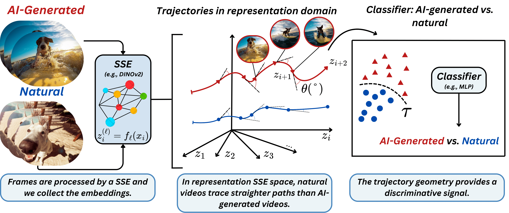

# ReStraV: AI-Generated Video Detection via Perceptual Straightening

[](https://neurips.cc/virtual/2025/poster/118520)
[](https://arxiv.org/abs/2507.00583)

Official implementation of the paper **"AI-Generated Video Detection via Perceptual Straightening"**, accepted at NeurIPS 2025.


*Figure 1: The ReStraV method. Video frames are processed by a self-supervised encoder (DINOv2) to get embeddings. In this representation space, natural videos trace "straighter" paths than AI-generated ones. The trajectory's geometry, especially its curvature, serves as a powerful signal for a lightweight classifier to distinguish real from fake.*

---

### 🚧 Code Coming Soon! 🚧
> Work in progress. Please check back soon for the code implementation!

---

## 🚀 Overview

**ReStraV** for detecting AI-generated videos. The core idea is inspired by the **"perceptual straightening" hypothesis**, which suggests that natural videos trace straighter paths in a neural network's representation space compared to synthetic ones.

We leverage a pre-trained vision model to extract frame embeddings and geometrical trajectory such us **perceptual curvature** and **stepwise distance** of a video's trajectory in this representation space. Our findings show that AI-generated videos exhibit significantly different curvature and distance patterns. A lightweight classifier trained on these geometric features achieves state-of-the-art performance, outperforming existing methods in accuracy, generalization, and computational efficiency.

## 🛠️ Installation

1.  Clone the repository:
    ```bash
    git clone [https://github.com/ChristianInterno/ReStraV.git](https://github.com/ChristianInterno/ReStraV.git)
    cd ReStraV
    ```

2.  Install the required dependencies. We recommend using a virtual environment.
    ```bash
    pip install -r requirements.txt
    ```
    The main dependencies are `torch`, `torchvision`, `numpy`, and `scikit-learn`.

## 📜 Citation

If you find our work useful in your research, please consider citing our paper:

```bibtex
@misc{internò2025aigeneratedvideodetectionperceptual,
      title={AI-Generated Video Detection via Perceptual Straightening}, 
      author={Christian Internò and Robert Geirhos and Markus Olhofer and Sunny Liu and Barbara Hammer and David Klindt},
      year={2025},
      eprint={2507.00583},
      archivePrefix={arXiv},
      primaryClass={cs.CV},
      url={https://arxiv.org/abs/2507.00583}, 
}
```

## Acknowledgements
This research was partly funded by Honda Research Institute Europe and Cold Spring Harbor Laboratory. We would like to thank Eero Simoncelli for insightful discussions and feedback, as well as all our colleagues from Google DeepMind, the Machine Learning Group at Bielefeld University, Honda Research Institute for the insightful discussions and feedback.
